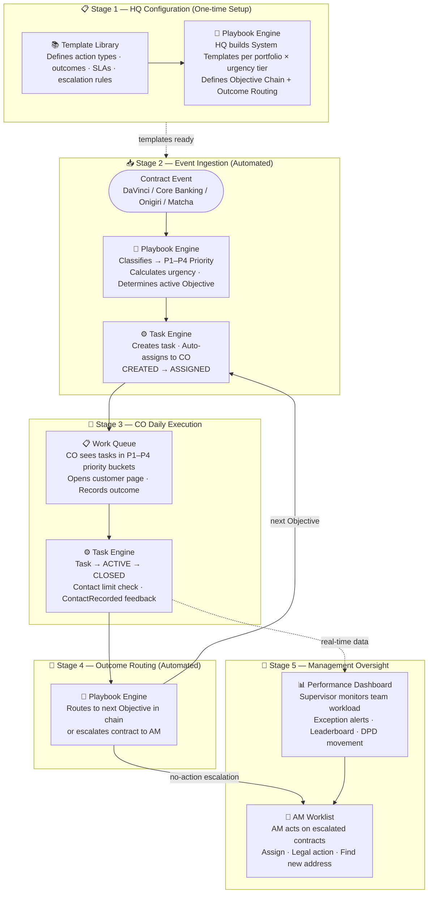
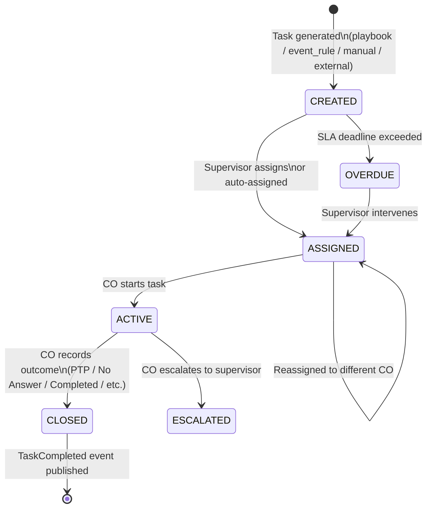
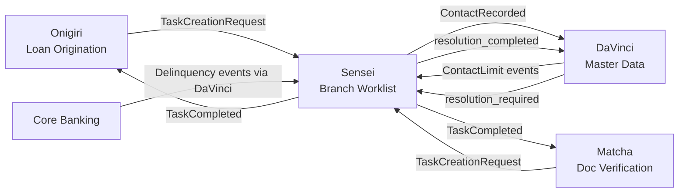

# Product: Branch Operations Orchestration

**Codename**: Sensei (先生)
**Portfolio**: Operations → [PORTFOLIO](../../PORTFOLIO.md)
**Status**: 📝 Draft
**Executive Owner**: COO / Head of Branch Operations
**Last Updated**: 2026-03-04

> *Sensei (先生) — The master who provides structure, guidance, and discipline. Sensei does not do the work — it orchestrates how work is done across branches, ensuring alignment with policy, visibility for leadership, and productivity for field staff.*

---

## Problem Statement

Branch field staff work across multiple products and systems (Onigiri for loans, Matcha for document tasks, delinquency systems for collections). Without a centralized worklist, COs must context-switch between systems to find their next action, resulting in missed tasks, inconsistent follow-up, and no unified accountability. Supervisors have no consolidated view of team throughput, contact compliance status, or exception alerts. Institutional knowledge about collection strategies exists as tribal knowledge, not executable playbooks.

---

## Value Proposition

A centralized branch worklist and task orchestration platform. Aggregates all branch work — from Sensei's own playbook-driven tasks, to external service requests (Onigiri, Matcha), to supervisor-created manual tasks — into a single prioritized queue with SLA tracking, gamified performance dashboards, contact compliance enforcement, and action verification.

**For whom**: Branch Credit Officers (COs) who execute daily work; Branch Supervisors who manage team performance and compliance; HQ who defines collection playbooks and compliance-locked strategies.

---

## Product Boundary

**This product IS responsible for:**
- Playbook Engine: HQ System Templates → Branch Variant model, compliance-locked steps, outcome-based transition routing, template version sync
- Task Engine: unified task lifecycle (CREATED → ASSIGNED → ACTIVE → CLOSED), event-driven task generation from DaVinci/Core Banking/Policy Admin, external task creation contract (TaskCreationRequest), task completion feedback (TaskCompleted)
- Work Queue: grouped action buckets (Calls/Visits/Admin/External), priority sub-groups, one-by-one primary processing mode, rapid-fire extended mode
- Performance & Visibility Dashboard: supervisor team workload + exception alerts; staff self-service metrics + gamified leaderboard
- Contact compliance **enforcement**: Task Engine queries BOS collection note log at task generation time (if daily limit reached → task suppressed); subscribes to ContactWindowClosed event for business hours enforcement; publishes ContactRecorded to DaVinci on every Call/Visit closure
- Action verification: cross-reference recorded Call outcomes against BOS collection note log (trust-but-verify; does not block CO workflow); verification status and mismatches surfaced in Performance Dashboard
- Template Library: single source of truth for all configurable playbook settings with role-based governance (HQ / AM per setting); covers action types, outcomes, required fields, SLA defaults, retry limits, urgency tier mappings, priority event mappings (P1–P4), objective timing configurations, talking points, and compliance-lock definitions
- AM Worklist: area manager operational queue for escalated and manually-added contracts; AM assign / legal action / find new address actions

**This product IS NOT responsible for:**
- Contact compliance **data ownership** — contact log, frequency limits, cross-product aggregation (owned by **DaVinci**)
- Loan workflow orchestration, application state management (owned by **Onigiri**)
- Document verification logic or QA workflow (owned by **Matcha**)
- Customer master data and Golden Record (owned by **DaVinci**)
- ResolutionRequest lifecycle state — Sensei creates and completes tasks, DaVinci owns the resolution state (owned by **DaVinci**)

**This product RECEIVES from:**
- DaVinci → ContactWindowClosed event (business hours enforcement) → via event subscription
- DaVinci → risk_level (active portfolio) and easiness_to_collect (write-off portfolio) scores per contract → used for urgency tier classification (Sensei owns the mapping rules, not the raw scores)
- DaVinci → customer.resolution_required events (creates Admin tasks for COs) → via event subscription
- Onigiri → TaskCreationRequest events when loan workflow needs branch action → via event
- Matcha → TaskCreationRequest events when doc verification needs branch action → via event
- Core Banking / Policy Admin → delinquency and renewal events (via DaVinci event rules) → via event

**This product SENDS to:**
- DaVinci → ContactRecorded event after each contact task completion → via event
- DaVinci → customer.resolution_completed event after resolution tasks → via event
- Onigiri → TaskCompleted event with outcome, completed_by, source_ref_id → via event
- Matcha → TaskCompleted event with outcome → via event

---

## Capability Registry

| Capability | Owner | Status | Stage | Description |
|-----------|-------|--------|-------|-------------|
| [Template Library](capabilities/template-library/CAPABILITY.md) | Product | Draft | 1 — HQ Configuration | Single source of truth for all configurable playbook settings with role-based governance (HQ / AM). Covers: action types + outcomes + required fields, SLA defaults, retry limits, urgency tier mappings, priority event mappings (P1–P4), objective timing configurations, talking points, and compliance-lock definitions. Playbook Engine consumes these settings; Template Library governs them. |
| [Playbook Engine](capabilities/playbook-engine/CAPABILITY.md) | Product | Draft | 1 — HQ Configuration · 2 — Event Ingestion · 4 — Outcome Routing | Assembles and executes collection strategies using settings governed by Template Library. Owns: Objective Chain structure, outcome routing between Objectives, Branch Variant fork model, compliance-locked steps (🔒), template version sync. Sequencing and routing logic lives here — all configurable parameters (timing, SLAs, retry counts, urgency mappings) are defined and governed in Template Library. |
| [Task Engine](capabilities/task-engine/CAPABILITY.md) | Engineering | Draft | 2 — Event Ingestion · 3 — CO Execution | Unified task lifecycle (CREATED → ASSIGNED → ACTIVE → CLOSED + OVERDUE + ESCALATED). 3 task sources: playbook_step, manual, external. Contact limit pre-check + ContactWindowClosed enforcement. ContactRecorded feedback to DaVinci. TaskCompleted feedback events. |
| [Work Queue](capabilities/work-queue/CAPABILITY.md) | Engineering | Draft | 3 — CO Execution | Grouped action buckets (Calls/Visits/Admin). Priority sub-groups (Overdue > High DPD > Normal). One-by-one primary mode. Rapid-fire extended mode. Daily contact limit enforcement. |
| [Performance Dashboard](capabilities/performance-dashboard/CAPABILITY.md) | Product | Draft | 5 — Management Oversight | Supervisor view: team workload table, active playbooks, exception panel (5 alert types), daily scorecard, contact compliance status. Staff view: personal metrics, monthly objectives, branch rank, gamified leaderboard, supervisor feedback. |
| [AM Worklist](capabilities/am-worklist/CAPABILITY.md) | Product | Draft | 5 — Management Oversight | AM's operational contract list — สัญญาที่อยู่ภายใต้การดูแลของพื้นที่. Auto-escalated from expired เอาวันนัดชำระ tasks + manually pulled by AM from branch collection list. AM actions: AM assign (มอบหมายงาน), legal action (ดำเนินคดี), find new address (หาที่อยู่ใหม่). |

---

## Capability Map

---

## Task Lifecycle

---

## Integration Map

---

## Product-Level Metrics and KPIs

| Metric | Description | Target |
|--------|-------------|--------|
| CO Daily Throughput | Avg. tasks completed per CO per day | > 350 |
| Contact Compliance Rate | % of days with zero contact limit violations per branch | 100% |
| SLA Breach Rate | % of tasks that expire OVERDUE without supervisor intervention within 4 hours | < 5% |
| Playbook Completion Rate | % of initiated playbooks that reach End (Success) vs. End (Failed) | Track per playbook type |
| Action Verification Rate | % of Call tasks with Verified status from BOS collection note log cross-check | > 95% |

---

## Detailed Reference

For full capability specifications, playbook design decisions, and integration contracts, see: [ATLAS.md](ATLAS.md)
