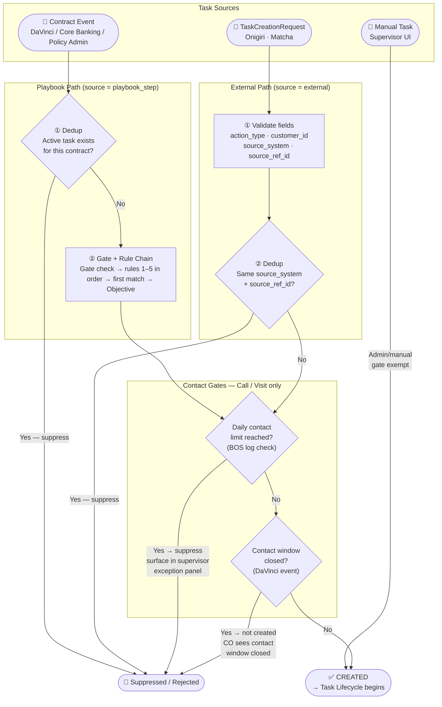
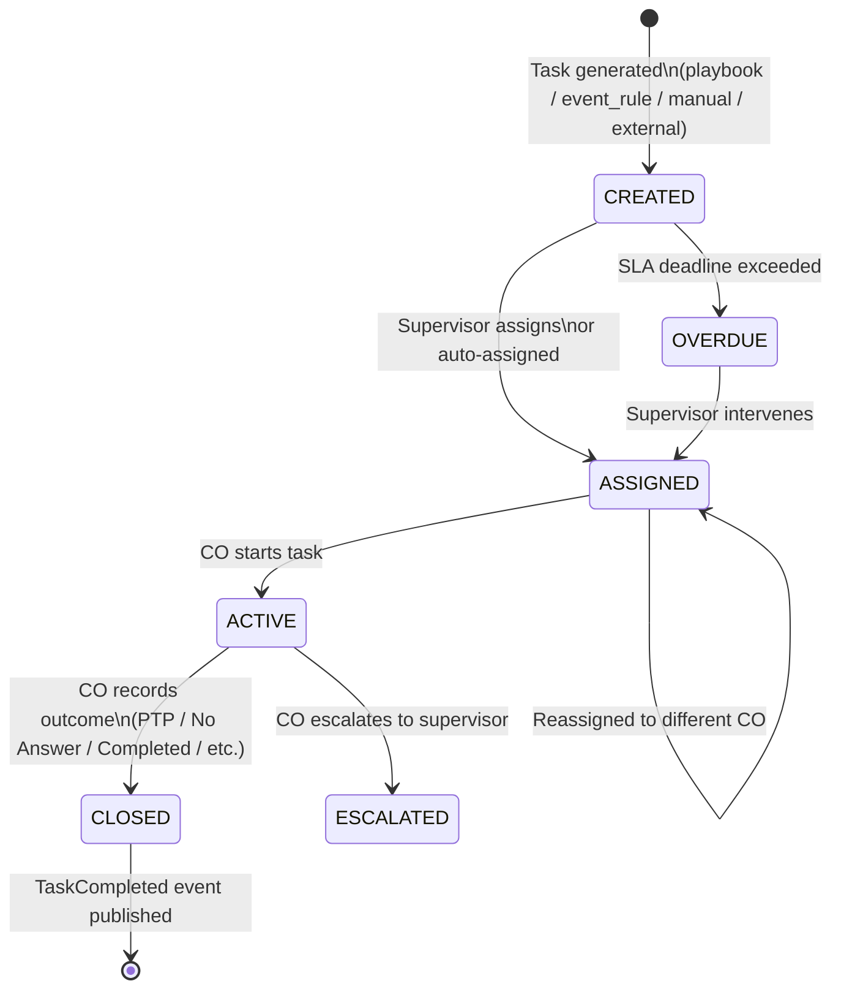
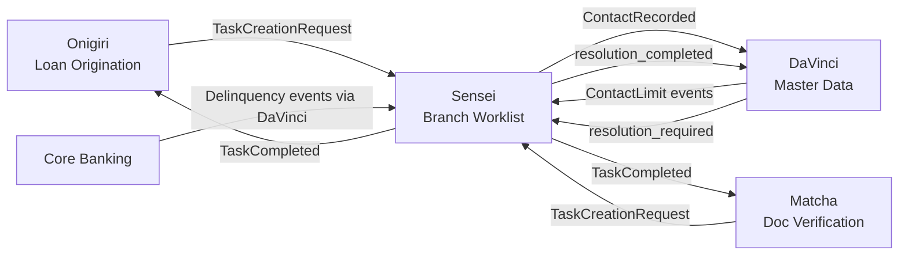

# Product: Branch Operations Orchestration

**Codename**: Sensei (先生)
**Portfolio**: Operations → [PORTFOLIO](../../PORTFOLIO.md)
**Status**: 📝 Draft
**Executive Owner**: COO / Head of Branch Operations
**Last Updated**: 2026-03-04

> *Sensei (先生) — The master who provides structure, guidance, and discipline. Sensei does not do the work — it orchestrates how work is done across branches, ensuring alignment with policy, visibility for leadership, and productivity for field staff.*

---

## Problem Statement

Branch field staff work across multiple products and systems (Onigiri for loans, Matcha for document tasks, delinquency systems for collections). Without a centralized worklist, COs must context-switch between systems to find their next action, resulting in missed tasks, inconsistent follow-up, and no unified accountability. Supervisors have no consolidated view of team throughput, contact compliance status, or exception alerts. Institutional knowledge about collection strategies exists as tribal knowledge, not executable playbooks.

---

## Value Proposition

A centralized branch worklist and task orchestration platform. Aggregates all branch work — from Sensei's own playbook-driven tasks, to external service requests (Onigiri, Matcha), to supervisor-created manual tasks — into a single prioritized queue with SLA tracking, gamified performance dashboards, contact compliance enforcement, and action verification.

**For whom**: Branch Credit Officers (COs) who execute daily work; Branch Supervisors who manage team performance and compliance; HQ who defines collection playbooks and compliance-locked strategies.

---

## Product Boundary

**This product IS responsible for:**
- Playbook Engine: gate evaluation, rule chain (objective selection), action types, timing parameters, compliance-locked steps, HQ System Templates → Branch Variant model, template version sync
- Task Engine: unified task lifecycle (CREATED → ASSIGNED → ACTIVE → CLOSED), event-driven task generation from DaVinci/Core Banking/Policy Admin, external task creation contract (TaskCreationRequest), task completion feedback (TaskCompleted)
- Work Queue: P1–P4 priority buckets, contract table with urgency display (`risk_level` / `easiness_to_collect`), one-by-one processing mode
- Performance & Visibility Dashboard: supervisor team workload + exception alerts; staff self-service metrics + gamified leaderboard
- Contact compliance **enforcement**: Task Engine queries BOS collection note log at task generation time (if daily limit reached → task suppressed); subscribes to ContactWindowClosed event for business hours enforcement; publishes ContactRecorded to DaVinci on every Call/Visit closure
- Action verification: cross-reference recorded Call outcomes against BOS collection note log (trust-but-verify; does not block CO workflow); verification status and mismatches surfaced in Performance Dashboard
- AM execution queue (สัญญาที่อยู่ภายใต้การดูแลของพื้นที่): auto-escalated and manually-added contracts in Work Queue (AM view); AM assign / legal action / find new address actions

**This product IS NOT responsible for:**
- Contact compliance **data ownership** — contact log, frequency limits, cross-product aggregation (owned by **DaVinci**)
- Loan workflow orchestration, application state management (owned by **Onigiri**)
- Document verification logic or QA workflow (owned by **Matcha**)
- Customer master data and Golden Record (owned by **DaVinci**)
- ResolutionRequest lifecycle state — Sensei creates and completes tasks, DaVinci owns the resolution state (owned by **DaVinci**)

**This product RECEIVES from:**
- DaVinci → ContactWindowClosed event (business hours enforcement) → via event subscription
- DaVinci → `risk_level` (active portfolio) and `easiness_to_collect` (write-off portfolio) per contract → displayed as urgency in Work Queue for sort and triage
- DaVinci → customer.resolution_required events (creates Admin tasks for COs) → via event subscription
- Onigiri → TaskCreationRequest events when loan workflow needs branch action → via event
- Matcha → TaskCreationRequest events when doc verification needs branch action → via event
- Core Banking / Policy Admin → delinquency and renewal events (via DaVinci event rules) → via event

**This product SENDS to:**
- DaVinci → ContactRecorded event after each contact task completion → via event
- DaVinci → customer.resolution_completed event after resolution tasks → via event
- Onigiri → TaskCompleted event with outcome, completed_by, source_ref_id → via event
- Matcha → TaskCompleted event with outcome → via event

---

## Capability Registry

| Capability | Owner | Status | Stage | Description |
|-----------|-------|--------|-------|-------------|
| [Playbook Engine](capabilities/playbook-engine/CAPABILITY.md) | Product | Draft | 1 — HQ Configuration · 2 — Event Ingestion | Single source of truth for collection task configuration and evaluation logic. Gate evaluation, rule chain (objective selection), action types, SLA defaults, timing parameters, compliance-locked steps, HQ System Templates, Branch Variant fork model, setting governance. Re-evaluates after every task closure — no hardcoded transition routing. |
| [Task Engine](capabilities/task-engine/CAPABILITY.md) | Engineering | Draft | 2 — Event Ingestion · 3 — CO Execution | Unified task lifecycle (CREATED → ASSIGNED → ACTIVE → CLOSED + OVERDUE + ESCALATED). 3 task sources: playbook_step, manual, external. Contact limit pre-check + ContactWindowClosed enforcement. ContactRecorded feedback to DaVinci. TaskCompleted feedback events. |
| [Work Queue](capabilities/work-queue/CAPABILITY.md) | Engineering | Draft | 3 — CO Execution · 5 — Management Oversight | Branch: P1–P4 priority buckets, contract table with urgency display, one-by-one processing mode. AM+: สัญญาที่อยู่ภายใต้การดูแลของพื้นที่ — escalated + manually-added contracts; AM actions: มอบหมายงาน / ดำเนินคดี / หาที่อยู่ใหม่. |
| [Performance Dashboard](capabilities/performance-dashboard/CAPABILITY.md) | Product | Draft | 5 — Management Oversight | Home Dashboard + Performance Summary for all levels (Branch and AM+); role-scoped widgets and metrics. AM+: Branch Collection Browse (การติดตามหนี้ในแต่ละสาขา) — full contract list per branch for AM oversight and manual pull into Work Queue. |

---

## Task Generation Pipeline

How a task moves from trigger to `CREATED` state — covering all three source paths, deduplication, template selection, and contact gate enforcement.

---

## Task Lifecycle

---

## Task Creation Reference

Every task in Sensei is classified by a **Work Domain** — the primary field that determines which playbook template, priority event mapping, and queue tab applies. HQ can add new work domains and sub-types by registering them in Playbook Engine (event mapping + System Templates) with no engineering changes required.

### Work Domain Overview

| Work Domain | Sub-type | Entry Criteria | Event Source | Urgency Dimension | Work Queue Tab |
|-------------|----------|----------------|-------------|-------------------|----------------|
| Collection | Active | `contract.status = active` AND delinquency/pre-due state reached | Core Banking → DaVinci | `risk_level` (1–6); higher = higher risk | Collection |
| Collection | Write-off | `contract.status = write_off` | Core Banking → DaVinci | `easiness_to_collect` (1–7); higher = easier to recover | Collection |
| Collection | Litigation | `contract.status = litigation` | Legal system → DaVinci | TBD | Collection |
| Sales | Insurance Renewal | `insurance.status = active` AND `expiry_date` within renewal window | Policy Admin → DaVinci | Days to expiry; fewer days = higher urgency | Sales |
| Offerings | Top-up | Customer meets Core Banking top-up eligibility criteria | Core Banking → DaVinci | TBD (campaign priority) | Offerings |
| Offerings | Nano | Customer meets Core Banking nano eligibility criteria | Core Banking → DaVinci | TBD (campaign priority) | Offerings |
| Offerings | Insurance | Customer meets insurance product eligibility criteria | Policy Admin → DaVinci | TBD (campaign priority) | Offerings |

---

### Two Key Dimensions: Priority vs. Urgency

These are independent — do not conflate them.

| Dimension | Determined By | Configured By | Drives |
|-----------|--------------|--------------|--------|
| **Priority (P1–P4)** | Contract state at display time (`due_date`, `PTP_date`, `contract.status` vs. today) | Work Queue — evaluated per contract each time the queue loads | Which Work Queue **group** the contract appears in — grouping only; does not determine which Objective is activated |
| **Urgency Score** | Contract-level score (`risk_level`, `easiness_to_collect`, days-to-expiry) | Sourced from contract record — no HQ mapping | Sort order **within** a priority bucket; triage signal for COs |

P1–P4 determines Work Queue grouping only. Objective selection is handled by the Rule Chain Evaluator based on contract attributes at evaluation time. Urgency score affects which contracts are worked first within the same group — not which group they land in.

---

### Common Gates — Contact Tasks Only (All Work Domains)

Every Call or Visit task passes through these gates before being created, regardless of domain, sub-type, or source. Admin and manual tasks are exempt.

| Gate | Data Source | Passes → | Fails → |
|------|------------|----------|---------|
| Contact limit | BOS collection note log | Task created normally | Task **suppressed**; contract flagged in supervisor exception panel |
| Contact window | DaVinci `ContactWindowClosed` event | Task created normally | Task **not created**; CO sees "Contact window closed" |

---

### External Tasks — Cross-Domain (source = external)

Triggered by Onigiri or Matcha publishing a `TaskCreationRequest` event. Applies across any work domain.

| Validation | Condition | Reject if |
|-----------|-----------|-----------|
| `action_type` | Must exist in Playbook Engine → Action Type Registry | Unknown type |
| `customer_id` | Must be a valid DaVinci customer ID | Invalid |
| `source_system` | Must be declared (e.g., "onigiri", "matcha") | Missing |
| `source_ref_id` | Must be present | Missing |

**Deduplication**: Duplicate request with same `source_system + source_ref_id` → suppressed (idempotent).
**Contact gate**: Applied if `action_type` = Call or Visit.

---

### Manual Tasks — Cross-Domain (source = manual)

Triggered by Supervisor creating a one-off task in the UI. Applies across any work domain.

| Validation | Condition |
|-----------|-----------|
| `action_type` | Must be valid per Playbook Engine → Action Type Registry |
| CO | Must be assigned |

**Contact gate**: Not applied — manual and Admin tasks are exempt.

---

### Suppression & Soft-Stop Cases

| Scenario | Applies To | Result | Surfaced In |
|----------|-----------|--------|-------------|
| Contact daily limit reached | All domains — Call/Visit tasks | Task suppressed | Supervisor exception panel |
| Contact window closed (outside business hours) | All domains — Call/Visit tasks | Task not created | CO sees "Contact window closed" |
| Active task already exists for this contract | Playbook-driven tasks | Event suppressed; no duplicate task | Silent deduplication |
| Duplicate TaskCreationRequest (same source_system + source_ref_id) | External tasks | Request suppressed | Silent; idempotent |
| Required validation fields missing | External tasks | Request rejected | Source system notified |
| Outcome = decline / not interested | Sales, Offerings domains | **Soft-stop**: new tasks suppressed for N months (HQ-configurable) | No exception panel — expected outcome |

---

### Work Queue Tab Structure

Each work domain feeds a **separate top-level tab** in the Work Queue. Within each tab, contracts are grouped by P1–P4 sub-buckets and sorted by urgency score within each bucket.

| Tab | Work Domains |
|-----|-------------|
| Collection | Active, Write-off, Litigation |
| Sales | Insurance Renewal |
| Offerings | Top-up, Nano, Insurance |

> Full Work Queue tab design is specified in [Work Queue CAPABILITY.md](capabilities/work-queue/CAPABILITY.md).

---

## Integration Map

---

## Product-Level Metrics and KPIs

| Metric | Description | Target |
|--------|-------------|--------|
| CO Daily Throughput | Avg. tasks completed per CO per day | > 350 |
| Contact Compliance Rate | % of days with zero contact limit violations per branch | 100% |
| SLA Breach Rate | % of tasks that expire OVERDUE without supervisor intervention within 4 hours | < 5% |
| Playbook Completion Rate | % of initiated playbooks that reach End (Success) vs. End (Failed) | Track per playbook type |
| Action Verification Rate | % of Call tasks with Verified status from BOS collection note log cross-check | > 95% |

---

## Detailed Reference

For full capability specifications, playbook design decisions, and integration contracts, see: [ATLAS.md](ATLAS.md)
