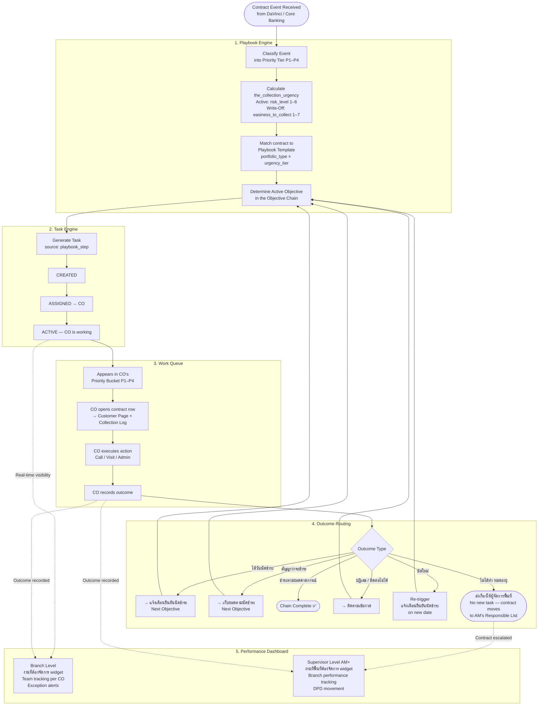
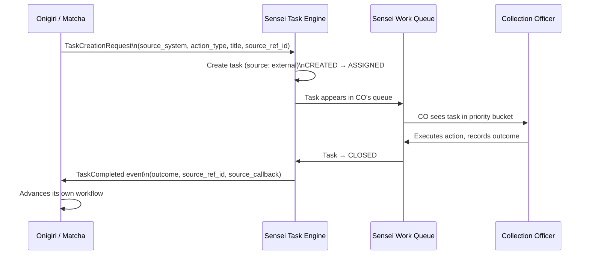

# Sensei — End-to-End Operational Workflow

**Product**: Sensei — Branch Operations Orchestration
**Purpose**: Shows how all four core capabilities work together as a single operational system — from contract event input through task execution to performance visibility.

---

## Full System Flow



---

## Phase-by-Phase Breakdown

### Phase 1 — Event Ingestion & Classification (Playbook Engine)

| Step | What Happens | Owner |
|------|-------------|-------|
| 1.1 | Contract event arrives from DaVinci / Core Banking | External |
| 1.2 | Event is matched to a Priority Tier (P1–P4) | Playbook Engine |
| 1.3 | `the_collection_urgency` is calculated for the contract | Playbook Engine |
| 1.4 | Contract is matched to a Playbook Template by `portfolio_type × urgency_tier` | Playbook Engine |
| 1.5 | Active Objective in the chain is determined | Playbook Engine |

**Priority Classification:**

| Priority | Contract State |
|----------|---------------|
| P1 | Due today / Appointment today |
| P2 | Approaching due / Pre-appointment reminder |
| P3 | No appointment set / Missed commitment |
| P4 | Write-Off portfolio |

**Urgency Score:**

| Portfolio | Dimension | Sort |
|-----------|-----------|------|
| Active | `risk_level` 1–6 | Higher = collect first |
| Write-Off | `easiness_to_collect` 1–7 | Higher (easiest) = collect first |

---

### Phase 2 — Task Creation & Assignment (Task Engine)

| Step | What Happens | State |
|------|-------------|-------|
| 2.1 | Playbook Engine generates a task (`source: playbook_step`) | CREATED |
| 2.2 | System auto-assigns to available CO in branch | ASSIGNED |
| 2.3 | CO picks up the task | ACTIVE |
| 2.4 | If SLA expires before completion → task flags as OVERDUE | OVERDUE |
| 2.5 | CO escalates to supervisor if blocked | ESCALATED |

```
CREATED → ASSIGNED → ACTIVE → CLOSED
                        ↓           ↑
                    ESCALATED → supervisor resolves
    ↓ (SLA breach)
  OVERDUE → surfaces in supervisor exception panel
```

**External Tasks (Onigiri / Matcha)** follow the same lifecycle:
- Onigiri or Matcha publishes `TaskCreationRequest` event
- Sensei creates task with `source: external`
- CO completes it → Sensei fires `TaskCompleted` back to source system
- Source system advances its own workflow

---

### Phase 3 — CO Processing (Work Queue)

| Step | What Happens |
|------|-------------|
| 3.1 | CO opens Work Queue — sees P1–P4 priority buckets |
| 3.2 | Default sort: Overdue → highest urgency → earliest deadline |
| 3.3 | CO clicks a contract row → Customer Page opens |
| 3.4 | CO sees: full customer profile, collection log, active task |
| 3.5 | CO executes action (Call / Visit / Admin) |
| 3.6 | CO records outcome with conditional fields (e.g., PTP → amount + date) |
| 3.7 | Task moves to CLOSED; row is removed from bucket |

**Processing Modes:**

| Mode | When to Use |
|------|------------|
| One-by-One | Default — full context per contract; suited for complex cases |
| Rapid-Fire | High-volume experienced COs — auto-advance, large tap targets |

**Contact Limit Guard:**
- Max 2 contacts per customer per day (configurable)
- Row flagged "⚠️ Contact limit reached" → task auto-skipped
- DaVinci emits `ContactLimitReached` event; Sensei enforces the skip

---

### Phase 4 — Outcome Routing (Playbook Engine)

After the CO records an outcome, the Playbook Engine routes to the next step in the Objective Chain:

#### Objective Chain

```
เอาวันนัดชำระ  [DL: d | attempts: 3]
  ├── ได้วันนัดชำระ       (success)       → แจ้งเตือนยืนยันนัดชำระ [DL: PTP−1]
  ├── ไม่ได้วันนัดชำระ    (do not success) → ติดตามเข้มงวด [DL: d+3]
  ├── ปฏิเสธการชำระ      (hard reject)    → ติดตามเข้มงวด [DL: d+3]
  └── ไม่ได้ทำ (หมดอายุ) (no action)     → 🔒 ส่งเรื่องให้ผู้จัดการพื้นที่ (no new task)
                                              AM actions: AM assign / legal action / find new address

แจ้งเตือนยืนยันนัดชำระ  [DL: PTP−1 | attempts: 3]
  ├── สัญญาว่าจะชำระ    → เก็บยอดตามนัดชำระ [DL: PTP]
  ├── ปฏิเสธการชำระ     → ติดตามเข้มงวด [DL: d+3]
  ├── นัดวันชำระใหม่    → แจ้งเตือนยืนยันนัดชำระ (re-trigger on new date)
  └── ติดต่อไม่ได้       → ติดตามเข้มงวด [DL: d+3]

เก็บยอดตามนัดชำระ  [DL: PTP | attempts: 3]  ← "paid full?" check
  ├── ชำระตามยอดคาดการณ์      (paid full)             → ✅ Chain Complete
  └── ไม่ชำระ / ชำระไม่ครบ    (do not get payment)    → ติดตามเข้มงวด [DL: d+3]

ติดตามเข้มงวด  [รอบแรก DL: d+3 | att: 1 → หลังได้ PTP ใหม่ DL: PTP+1 | att: 1]
  ├── ได้นัดชำระใหม่           (get PTP)   → เก็บยอดตามนัดชำระ (re-enter at DL: PTP+1)
  ├── ชำระตามยอดคาดการณ์      (paid full) → ✅ Chain Complete
  └── ไม่ได้ผล                 (no)        → ติดตามเข้มงวด (re-queue, loop)
```

**End Conditions:**

| Condition | Result |
|-----------|--------|
| ชำระตามยอดตามคาดการณ์ | ✅ Chain ends (Success) |
| Restructure | ✅ Chain ends (Success — TBD) |
| Repossession | ✅ Chain ends (Closed — TBD) |
| ไม่ได้ทำ (หมดอายุ) on เอาวันนัดชำระ | 🔒 Escalated to AM's responsible list |

---

### Phase 5 — Escalation to AM (Performance Dashboard → B2)

When outcome = `ไม่ได้ทำ (หมดอายุ)` on เอาวันนัดชำระ:

1. **No new task is created**
2. Contract is moved atomically into **สัญญาที่อยู่ภายใต้การดูแลของพื้นที่** (AM's responsible list)
3. AM sees the contract in their dashboard widget **งานที่พื้นที่ต้องจัดการ**
4. AM actions per contract:

| Action | Description |
|--------|-------------|
| AM assign (มอบหมายงาน) | Assign back to original branch, reassign to another branch, or handle directly |
| Legal action (ดำเนินคดี) | Escalate contract to legal proceedings |
| Find new address (หาที่อยู่ใหม่) | Initiate address search for uncontactable customer |

AM can also **manually pull** any contract from การติดตามหนี้ในแต่ละสาขา into their responsible list at any time.

---

### Phase 6 — Supervisor Monitoring & Intervention (Performance Dashboard)

#### Branch Level (Branch Supervisors)

| Signal | Action |
|--------|--------|
| Idle Staff — no activity > 1 hour | Review, send message |
| Low Performance — completion rate < 40% at midday | Intervene, reassign |
| Contact Blocked — customer hit daily limit | Plan next-day contact |
| Playbook Stuck — step awaiting approval | Approve or reject step |
| SLA Breach — task overdue > 4 hours | Reassign or escalate |

Available controls: Reassign tasks, override playbook step, add manual task, bulk reassign (e.g., staff absence).

#### Supervisor / AM Level

| View | What It Shows |
|------|--------------|
| ติดตามผลการทำงานของสาขา | Branch performance per branch — today and this week |
| ภาพรวมการทำงานประจำวันนี้ | Daily ยอดสินเชื่อ + ยอดการขาย vs. target |
| ภาพรวมการทำงานเดือนนี้ | Monthly cumulative vs. target |
| การไหลของ DPD | DPD movement C→X and X→30 — current and prior month |

---

## External Integration Workflow (Onigiri / Matcha → Sensei)



| Field | Purpose |
|-------|---------|
| `source_system` | Identifies origin: `"onigiri"` / `"matcha"` |
| `source_ref_id` | Links back to loan_application_id or verification_task_id |
| `source_callback` | Event topic Sensei fires `TaskCompleted` to |
| `metadata` | Opaque context — stored by Sensei, never interpreted |

**Sensei's rule**: It does not know or care about the upstream domain logic. It receives the task, assigns it to a CO, records the outcome, and fires back `TaskCompleted`. The originating system decides what to do next.

---

## Capability Interaction Summary

```
┌─────────────────────────────────────────────────────────────────────┐
│                          SENSEI SYSTEM                               │
│                                                                       │
│  ┌──────────────────┐    triggers    ┌─────────────────────────┐    │
│  │  Playbook Engine │ ─────────────▶ │      Task Engine        │    │
│  │                  │                │  CREATED→ASSIGNED→      │    │
│  │  - P1–P4 events  │ ◀───────────── │  ACTIVE→CLOSED          │    │
│  │  - Urgency score │  outcome route │                         │    │
│  │  - Objective     │                └────────────┬────────────┘    │
│  │    Chain         │                             │                  │
│  └──────────────────┘                             │ assigns          │
│                                                   ▼                  │
│  ┌──────────────────────────────────────────────────────────────┐   │
│  │                       Work Queue                              │   │
│  │   P1 │ P2 │ P3 │ P4   →  Customer Page  →  Outcome Entry    │   │
│  └──────────────────────────────────────────────────────────────┘   │
│                                ↑ (feeds)                             │
│  ┌──────────────────────────────────────────────────────────────┐   │
│  │               Performance Dashboard                           │   │
│  │   Branch Level: team tracking, exceptions, scorecard          │   │
│  │   Supervisor Level: area performance, DPD, AM contracts       │   │
│  └──────────────────────────────────────────────────────────────┘   │
└─────────────────────────────────────────────────────────────────────┘
           ▲                                          │
           │ TaskCreationRequest                      │ TaskCompleted
           │                                          ▼
    ┌──────────────┐                        ┌──────────────────┐
    │ Onigiri /    │◀───────────────────────│ Onigiri / Matcha │
    │ Matcha       │                        │ advance workflow │
    └──────────────┘                        └──────────────────┘
```
