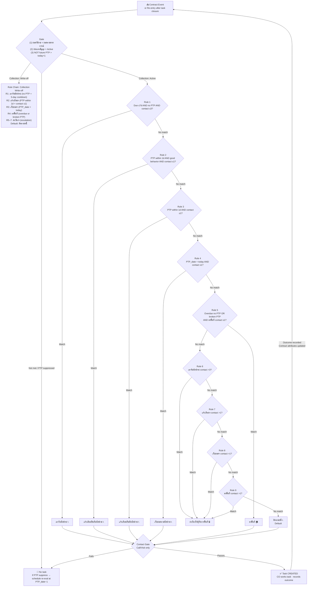

# Capability: Playbook Engine

**Product**: Sensei — [PRODUCT](../../PRODUCT.md)
**Portfolio**: Operations
**Product Owner**: TBD (Operations PO)
**Status**: 📝 Draft — @FEATURE decomposition pending
**Last Updated**: 2026-03-13

---

## Business Function

Single source of truth for task configuration and evaluation logic across all portfolio types. Defines all configurable parameters (gate conditions, rule chain, action types, timing), evaluates each contract against those rules, and creates the correct task. Re-evaluates after every task closure so the next task emerges from updated contract state — no hardcoded transition routing needed.

## Why It Exists (First Principles)

- **Policy Alignment**: Thousands of branch staff must execute consistent strategies. Configurable rules replace tribal knowledge and branch-invented approaches.
- **Separation of config and logic**: HQ defines what the rules are. The engine applies them. Changing a rule doesn't require changing the engine.
- **Stateless evaluation**: Each evaluation reads only current contract attributes — no dependency on task history or chain state.
- **Adaptability**: HQ defines defaults. Branches (AM and above) adjust timing within guardrails.

---

## Feature Inventory

| Feature | Status | Description |
|---------|--------|-------------|
| Gate Evaluator | Draft | On receiving a contract event, checks contract eligibility and portfolio classification. Gate conditions are HQ-configurable per portfolio type. Suppresses evaluation if gate not met. |
| Rule Chain Evaluator | Draft | Runs the rule chain specific to the portfolio type identified by the gate. Each portfolio type has its own chain defined by HQ. Rules evaluated in fixed sequence — first match wins. |
| Task Instantiation | Draft | Creates all step tasks atomically in the Task Engine when an objective is activated. Reads timing params from Objective Configurations. |
| Re-entry Trigger | Draft | After a CO closes a task, re-enters the pipeline from the gate for that contract using updated contract attributes. |
| Playbook Builder (HQ) | Draft | HQ creates and manages System Templates per portfolio type with action types, timing, and compliance locks. |
| Branch Variant Fork | Draft | AM and above fork a System Template into a Branch Variant and adjust within allowed rules. |
| Compliance Lock Enforcement | Draft | Locked steps (🔒) cannot be removed, reordered past their boundary, or have their configuration modified by supervisors. |

---

## Part 1 — Task Creation

How a task gets created and appears in the Work Queue.

---

### 1.1 Gate

The gate is the **first check** on every evaluation — both on initial event and on re-entry after task closure. It does two things:

1. **Eligibility check** — is this contract in a state that requires action?
2. **Portfolio classification** — which portfolio type does it belong to? (determines which rule chain and template apply)

Gate configurations are **HQ-managed per portfolio type** and stored in the Playbook Engine. HQ can register new portfolio types and define their gate conditions and rule chain without engineering changes — the engine evaluates whichever gate configurations are active. If gate not met → suppress. No rule evaluation, no task created.

Each registered portfolio type carries three things: its gate conditions, its rule chain, and its System Template. The gate identifies the portfolio type — everything that follows (rule chain evaluation, task instantiation) is scoped to that type.

| Portfolio Type | Gate Conditions (all must be met) | Rule Chain |
|---|---|---|
| Collection: Active | (1) ยอดที่ชำระ < ยอดตามคาดการณ์ — (2) ประเภทสัญญา = Active — (3) NOT (PTP_date exists AND PTP_date > today + 1) | Collection: Active (→ 1.2.1) |
| Collection: Write-off | (1) ยอดที่ชำระ < ยอดเงินเป้า incentive tier 1 — (2) ประเภทสัญญา = Write-off | Collection: Write-off (→ 1.2.2) |

> HQ adds new portfolio types by registering gate conditions + a rule chain together. The gate is not hardcoded to collection — it is a configurable construct. When a contract is fully paid, the gate naturally fails on re-entry and no further tasks are created — no explicit "end chain" command needed.

> **PTP suppress (condition 3)**: A contract with a valid future PTP appointment (PTP_date > today + 1) is suppressed — no task is created while the customer is waiting to pay. The system schedules a re-evaluation at PTP_date − 1, at which point the gate passes and Rule 2 (แจ้งเตือนยืนยันนัดชำระ) fires. This re-evaluation is schedule-triggered, not task-closure-triggered, since no task was created to close.

---

### 1.2 Rule Chain Evaluation

Each portfolio type registered in the gate has its **own rule chain**, defined by HQ in the Playbook Builder. The gate identifies which portfolio type the contract belongs to — the engine then runs that type's chain. Rules are evaluated in sequence; **first match wins.** Evaluation is stateless — reads only current contract attributes.

#### 1.2.1 Collection: Active

All conditions within the same rule number are **AND**. Rules 6–9 are each single-condition escalation triggers (OR relationship — whichever fires first escalates).

> Contact counts (`การติดต่อ X`) are tracked **per objective type** — not total contacts. Each objective has its own counter, reset per installment cycle.

| # | Objective | Factor | Condition |
|---|---|---|---|
| 1 | เอาวันนัดชำระ | วันครบกำหนดชำระ | วันครบกำหนดชำระ ภายใน 7 วัน |
| 1 | เอาวันนัดชำระ | วันนัดชำระ | ยังไม่มีวันนัดชำระในงวด/เดือน |
| 1 | เอาวันนัดชำระ | การติดต่อเอาวันนัดชำระ | ≤ 3 ครั้งในงวดนี้ |
| 2 | แจ้งเตือนยืนยันนัดชำระ | วันนัดชำระ | มีวันนัดชำระ AND ภายใน 1 วัน |
| 2 | แจ้งเตือนยืนยันนัดชำระ | พฤติกรรมลูกค้า | ≠ ผิดนัดชำระบ่อย / ผิดนัดชำระบางครั้ง |
| 2 | แจ้งเตือนยืนยันนัดชำระ | การติดต่อแจ้งเตือนฯ | ≤ 1 ครั้งในงวดนี้ |
| 3 | แจ้งเตือนยืนยันนัดชำระ | วันนัดชำระ | มีวันนัดชำระ AND ภายใน 1 วัน |
| 3 | แจ้งเตือนยืนยันนัดชำระ | การติดต่อแจ้งเตือนฯ | ≤ 1 ครั้งในงวดนี้ |
| 4 | เก็บยอดตามนัดชำระ | วันนัดชำระ | = วันนี้ |
| 4 | เก็บยอดตามนัดชำระ | การติดต่อเก็บยอดฯ | ≤ 1 ครั้งในงวดนี้ |
| 5 | ลงพื้นที่ | สถานะ PTP | (PTP_date is null AND due_date < today) OR (PTP_date < today AND no payment recorded) |
| 5 | ลงพื้นที่ | การติดต่อลงพื้นที่ | ≤ 1 ครั้งในงวดนี้ |
| 6 | ส่งเรื่องให้ผู้จัดการพื้นที่ 🔒 | การติดต่อเอาวันนัดชำระ | > 3 ครั้งในงวดนี้ |
| 7 | ส่งเรื่องให้ผู้จัดการพื้นที่ 🔒 | การติดต่อแจ้งเตือนยืนยันนัดชำระ | > 1 ครั้งในงวดนี้ |
| 8 | ส่งเรื่องให้ผู้จัดการพื้นที่ 🔒 | การติดต่อเก็บยอดตามนัดชำระ | > 1 ครั้งในงวดนี้ |
| 9 | ส่งเรื่องให้ผู้จัดการพื้นที่ 🔒 | การติดต่อลงพื้นที่ | > 1 ครั้งในงวดนี้ |
| Default | ติดตามหนี้ | — | Gate passes AND no rule above matched |

**Worked examples:**

| Contract State | Rule Fired | Objective |
|---|---|---|
| Active, no PTP, due within 7 days, contact 0–3 | Rule 1 | เอาวันนัดชำระ |
| Has PTP, PTP tomorrow, good behavior, contact 0 | Rule 2 | แจ้งเตือนยืนยันนัดชำระ |
| Has PTP, PTP tomorrow, frequent defaulter, contact 0 | Rule 3 | แจ้งเตือนยืนยันนัดชำระ |
| PTP date = today, contact 0 | Rule 4 | เก็บยอดตามนัดชำระ |
| No PTP, overdue, ลงพื้นที่ contact 0 | Rule 5 | ลงพื้นที่ |
| Broken PTP (PTP_date < today, no payment), ลงพื้นที่ contact 0 | Rule 5 | ลงพื้นที่ |
| เอาวันนัดชำระ contacted 4+ times | Rule 6 | ส่งเรื่องให้ผู้จัดการพื้นที่ |
| แจ้งเตือนฯ contacted 2+ times | Rule 7 | ส่งเรื่องให้ผู้จัดการพื้นที่ |
| เก็บยอดฯ contacted 2+ times | Rule 8 | ส่งเรื่องให้ผู้จัดการพื้นที่ |
| ลงพื้นที่ contacted 2+ times | Rule 9 | ส่งเรื่องให้ผู้จัดการพื้นที่ |
| Gate passes, no rule matched | Default | ติดตามหนี้ |
| Has PTP, PTP_date > today + 1 | Gate suppressed | No task — scheduled re-evaluation at PTP_date − 1 |

#### 1.2.2 Collection: Write-off

All conditions within the same rule number are **AND**. Rules 5–7 are each single-condition escalation triggers (OR relationship — whichever fires first escalates).

> Contact counts (`การติดต่อ X`) are tracked **per objective type** — not total contacts. Each objective has its own counter, reset per installment cycle.

> **Rule 1 cooldown**: Unlike Collection: Active (which caps by count), Write-off uses a 5-day cooldown between contact attempts. Rule 1 fires as long as no PTP is set and the last contact was > 5 days ago (or never contacted). This produces a contact rhythm of every 6 days (5-day gap + day of contact).

| # | Objective | Factor | Condition |
|---|---|---|---|
| 1 | เอาวันนัดชำระ | วันนัดชำระ | ยังไม่มีวันนัดชำระในงวด/เดือน |
| 1 | เอาวันนัดชำระ | การติดต่อ | ยังไม่ได้ติดต่อใน 5 วัน |
| 2 | แจ้งเตือนยืนยันนัดชำระ | วันนัดชำระ | มีวันนัดชำระ ภายใน 1 วัน |
| 2 | แจ้งเตือนยืนยันนัดชำระ | การติดต่อแจ้งเตือนฯ | ≤ 1 ครั้งในงวดนี้ |
| 3 | เก็บยอดตามนัดชำระ | วันนัดชำระ | วันนัดชำระ = วันนี้ |
| 3 | เก็บยอดตามนัดชำระ | การติดต่อเก็บยอดตามนัดชำระ | ≤ 1 ครั้งในงวดนี้ |
| 4 | ลงพื้นที่ | สถานะ PTP | (PTP_date is null AND due_date < today) OR (PTP_date < today AND no payment recorded) |
| 4 | ลงพื้นที่ | การติดต่อลงพื้นที่ | ≤ 1 ครั้งในงวดนี้ |
| 5 | ส่งเรื่องให้ผู้จัดการพื้นที่ 🔒 | การติดต่อแจ้งเตือนยืนยันนัดชำระ | > 1 ครั้งในงวดนี้ |
| 6 | ส่งเรื่องให้ผู้จัดการพื้นที่ 🔒 | การติดต่อเก็บยอดตามนัดชำระ | > 1 ครั้งในงวดนี้ |
| 7 | ส่งเรื่องให้ผู้จัดการพื้นที่ 🔒 | การติดต่อลงพื้นที่ | > 1 ครั้งในงวดนี้ |
| Default | ติดตามหนี้ | — | Gate passes AND no rule matched |

**Worked examples:**

| Contract State | Rule Fired | Objective |
|---|---|---|
| Write-off, no PTP, last contact > 5 days ago | Rule 1 | เอาวันนัดชำระ |
| Write-off, no PTP, contacted within last 5 days | No match → Default | ติดตามหนี้ |
| Has PTP, PTP tomorrow, contact 0 | Rule 2 | แจ้งเตือนยืนยันนัดชำระ |
| PTP date = today, contact 0 | Rule 3 | เก็บยอดตามนัดชำระ |
| No PTP and overdue, ลงพื้นที่ contact 0 | Rule 4 | ลงพื้นที่ |
| Broken PTP (PTP_date < today, no payment), ลงพื้นที่ contact 0 | Rule 4 | ลงพื้นที่ |
| แจ้งเตือนฯ contacted 2+ times | Rule 5 | ส่งเรื่องให้ผู้จัดการพื้นที่ |
| เก็บยอดฯ contacted 2+ times | Rule 6 | ส่งเรื่องให้ผู้จัดการพื้นที่ |
| ลงพื้นที่ contacted 2+ times | Rule 7 | ส่งเรื่องให้ผู้จัดการพื้นที่ |

---

### 1.3 Task Instantiation

Once the objective is determined, Playbook Engine instructs Task Engine to create all step tasks atomically. Either all tasks are created or none.

Tasks are created in `CREATED` state and auto-assigned per the template's assignee rules. The applicable System Template is determined by `portfolio_type` (set by the gate in 1.1). Contact gate checks (daily limit + contact window) apply before creation for Call and Visit tasks.

---

## Part 2 — Execution

How a CO works the task after it appears in their queue.

---

### 2.1 Action Types

Each objective is configured with a default action type. Action types are HQ-defined — no action type can be used unless it exists in the registry below. Outcomes are recorded in the collection log.

| Action Type | Typed Outcomes |
|-------------|----------------|
| 📞 Call | PTP, No Answer, Refused, Callback, Wrong Number, Line Busy, Voicemail |
| 🏠 Visit | Met Customer, Not Home, Address Invalid, PTP (in-person), Refused |

**Default action per objective:**

| Objective | Default Action |
|---|---|
| เอาวันนัดชำระ | 📞 Call |
| แจ้งเตือนยืนยันนัดชำระ | 📞 Call |
| เก็บยอดตามนัดชำระ | 📞 Call |
| ลงพื้นที่ | 🏠 Visit 🔒 |
| ติดตามหนี้ | 📞 Call |

---

### 2.2 Outcome Recording

CO records one outcome per task on closure. Each outcome updates one or more contract attributes, which are what the rule chain reads on re-entry.

| Outcome | Contract Attribute Updated |
|---|---|
| PTP date set | `PTP_date` |
| Payment recorded | `payment_amount`, `payment_status` |
| Refused | `refusal_recorded` |
| Can't contact | `last_contact_attempt_result` |
| Rescheduled PTP | `PTP_date` (updated to new date) |
| Task expired without action | `last_task_expired` |

> After task closure, the system automatically re-enters the pipeline (→ Part 3).

---

### 2.3 Compliance Locks

**Compliance-locked steps (🔒)** are mandated by HQ and cannot be modified by supervisors:
- Cannot be removed from the template
- Cannot be reordered past a defined boundary
- Timing adjustable only within HQ-set limits
- Outcome options visible but not modifiable

---

### 2.4 Supervisor Customization

> 💡 Not available in current scope. Supervisor-level template customization (branch variants, timing adjustments, step reordering) is a planned future capability.

---

## Part 3 — Results

What happens after a CO records an outcome.

---

### 3.1 Re-entry

After a CO closes a task with an outcome:

1. Contract attributes updated based on recorded outcome
2. System re-enters the pipeline from the **gate** (Part 1.2)
3. Gate re-evaluates:
   - **Gate not met** → no new task → contract exits collection
   - **Gate met** → rule chain re-evaluates
4. Rule chain re-evaluates against updated attributes:
   - Different rule matches → new task created for the new objective
   - Same rule still matches → task re-created per timing params (retry within limit)
   - No rule matches → default ติดตามหนี้ task created

```
CO closes task
      │
      ▼
Contract attributes updated
      │
      ▼
Re-enter pipeline ──→ Gate fails → No task · Contract exits collection
      │
   Gate passes
      │
      ▼
Rule Chain evaluates
      ├── Different rule matches → New objective task created
      ├── Same rule matches     → Re-queue (retry)
      └── No rule matches       → ติดตามหนี้ (default)
```

---

### 3.2 End Conditions

Collection ends when the gate condition is no longer met on re-entry.

| Condition | How It Ends |
|---|---|
| ยอดที่ชำระ >= ยอดตามคาดการณ์ | Gate fails on re-entry → no new task → contract exits collection |
| Restructure | TBD — closes gate condition |
| Repossession | TBD — closes gate condition |

---

## Configuration & Governance

---

### Setting Governance

This table is the **authoritative source** for role-based access across all Playbook Engine settings.

| Setting Category | Add | Adjust | Change | Who |
|-----------------|-----|--------|--------|-----|
| Action types (name, properties) | ✅ | ✅ | ✅ | HQ only |
| Outcomes per action type | ✅ | ✅ | ✅ | HQ only |
| Priority event mapping (event → P1–P4) | ✅ | ✅ | ✅ | HQ only |
| Gate configurations (per portfolio type) | ✅ | ✅ | ✅ | HQ only |
| Rule chain order and conditions (per portfolio type) | ✅ | ✅ | ✅ | HQ only |
| Objective timing & action (values) | ✅ | ✅ | ✅ | HQ only |
| Compliance-locked steps | ✅ | ✅ | ✅ | HQ only |
| Playbook Engine structure (schema) | ❌ | ❌ | ❌ | System-defined — immutable |

> **Branch variant scope**: AM adjustments apply to their branch variant only. HQ global default is unchanged. AM adjustments cannot exceed HQ-set limits.

---

### Timing Parameters by Objective

| Objective | DL | วันที่สร้างงาน (default) | อายุของงาน (default) | Retry (default) | AM-Adjustable |
|-----------|----|-----------------------|---------------------|----------------|---------------|
| เอาวันนัดชำระ | d (due date) | ก่อน due 7 วัน | 7 วัน | 3 ครั้ง | Timing ✅ |
| แจ้งเตือนยืนยันนัดชำระ | PTP − 1 วัน | ก่อนวันนัดชำระ 1 วัน | ภายในวัน | 3 ครั้ง | Timing ✅ |
| เก็บยอดตามนัดชำระ | PTP | วันนัดชำระ | ภายในวัน | 3 ครั้ง | Timing ✅ |
| ติดตามเข้มงวด — รอบแรก | d + 3 | วันที่ list ขึ้น | 3 วัน | 1 ครั้ง | Timing ✅; Action ❌ (locked) |
| ติดตามเข้มงวด — หลังได้ PTP | PTP + 1 | วันถัดจากวันนัดใหม่ | ภายในวัน | 1 ครั้ง | Timing ✅; Action ❌ (locked) |
| ติดตามหนี้ (default) | d | วันที่ list ขึ้น | 3 วัน | 2 ครั้ง | Timing ✅ |

---

### Playbook Hierarchy

| Level | Owner | Can Edit |
|-------|-------|----------|
| System Template | HQ | Gate conditions, rule chain, action types, timing, compliance locks |
| Branch Variant | AM and above | Timing + action type within HQ-set limits; cannot change gate or rule conditions |

System Templates are organized by `portfolio_type`. HQ manages which template applies to each portfolio type.

---

## Flow Diagram



> Each portfolio type registered in the gate has its own rule chain. The diagram above shows Collection: Active in full. Additional portfolio types (e.g., Write-off, Sales) follow the same pattern with their own rules defined by HQ.

---

## NFRs

| NFR | Requirement |
|-----|-------------|
| Gate configurability | HQ must be able to register new portfolio types and configure gate conditions without engineering changes |
| Re-entry atomicity | Re-entry evaluation and task creation after task closure must be atomic |
| Compliance lock integrity | Locked steps cannot be removed or reordered by any user except HQ |
| Version tracking | Branch variants must track which system template version they were forked from |
| Instantiation atomicity | Task instantiation must be atomic — all tasks created or none |
| Stateless evaluation | Rule chain reads only current contract attributes — no dependency on task history |
| No duplicate active task | Only one active task per objective per contract at any time |
| HQ-only enforcement | Settings marked "HQ only" must be restricted at system level |
| AM boundary enforcement | AM adjustments validated against HQ-set limits at save time |
| Reference stability | Existing instances referencing a setting must not break when the setting is updated |
