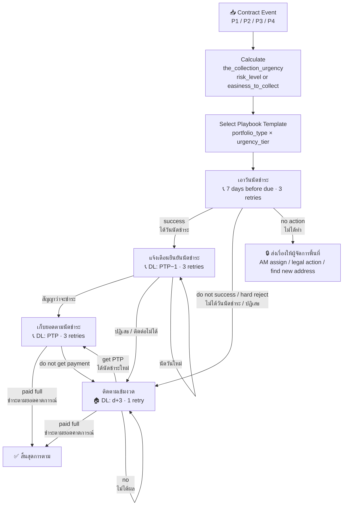

# Capability: Playbook Engine

**Product**: Sensei — [PRODUCT](../../PRODUCT.md)
**Portfolio**: Operations
**Product Owner**: TBD (Operations PO)
**Status**: 📝 Draft — @FEATURE decomposition pending
**Last Updated**: 2026-03-04

---

## Business Function

Provide a structured, reusable system for defining multi-step operational strategies (Playbooks) that drive how field staff handle specific collection objectives. Playbooks are triggered by priority-classified events, configured per portfolio type and collection urgency, and organized into a sequential N-stage Objective Chain (4 stages by default; HQ can add new objectives). Each stage follows the same chain structure. Advancing to the next stage or terminating depends on outcomes — full payment, restructure, or repossession end the chain.

## Why It Exists (First Principles)

- **Policy Alignment**: Thousands of branch staff across hundreds of branches must execute consistent strategies. Without structured playbooks, each branch invents its own approach, causing inconsistent outcomes and compliance risk.
- **Knowledge Codification**: Effective collection strategies are institutional knowledge. Playbooks capture this as executable templates, not tribal knowledge.
- **Urgency-Aware Execution**: Not all contracts are equal. The intensity of follow-up (timing, action type, retry count) must reflect how urgent collection is for that specific contract — driven by risk level and portfolio type.
- **Adaptability**: HQ defines the default strategy per urgency tier, but local conditions require branch-level customization within guardrails.

---

## Feature Inventory

| Feature | Status | Description |
|---------|--------|-------------|
| Event Trigger Processor | Draft | Classifies incoming contract events by priority and routes to the correct playbook objective |
| Collection Urgency Calculator | Draft | Computes `the_collection_urgency` from `risk_level` (active) or `easiness_to_collect` (write-off) |
| Playbook Objective Chain | Draft | Manages the N-stage chain (default: เอาวันนัดชำระ → แจ้งเตือนฯ → เก็บยอดฯ → ติดตามเข้มงวด); HQ can add new objectives to the chain — all follow the same structure. Advances or terminates based on outcomes. |
| Playbook Builder (HQ) | Draft | HQ creates System Templates per portfolio type + urgency tier, with step sequences, action types, timing, outcome transitions, and compliance locks |
| Branch Variant Fork | Draft | Supervisors fork a System Template into a Branch Variant with drag-and-drop step editing within allowed rules |
| Compliance Lock Enforcement | Draft | Locked steps (🔒) cannot be removed, reordered past their boundary, or have outcome transitions modified |
| Outcome Transition Router | Draft | Each step defines per-outcome transitions (Next Objective / Specific Step / Retry / End Chain / Escalate) |
| Template Version Sync | Draft | HQ publishes new template version; branches with variants notified to review and merge changes |
| Playbook Instantiation | Draft | When a playbook objective is triggered for a contract, step tasks are created atomically in the Task Engine |

---

## Relationship to Template Library

Template Library is the **definition and governance layer** — it defines what components exist and who can change them. Playbook Engine is the **assembly and execution layer** — it reads those definitions to build and run strategies.

| Template Library Component | Consumed by Playbook Engine | How |
|---------------------------|----------------------------|-----|
| Action Type Registry | Playbook Builder | Available action types when building step sequences; no action type can be used unless defined here |
| Objective Configurations | Objective Chain + Task creation | Task creation timing (วันที่สร้างงาน), lifespan (อายุของงาน), retry counts per objective |
| Urgency Tier Mapping | Collection Urgency Calculator | Maps risk_level / easiness_to_collect scores → urgency tier → template selection |
| Priority Event Mapping | Event Trigger Processor | Maps incoming contract events → priority tier + trigger date |
| Compliance-locked steps | Compliance Lock Enforcement | Which step categories HQ has designated as locked; Playbook Engine enforces at runtime |
| Setting Governance | — | Governance only — defines who can change what; not consumed at runtime |

---

## Configuration Ownership

Playbook Engine-specific configurable components (strategy assembly and sequencing). For all other settings (action types, urgency mappings, event triggers, objective timing, compliance locks), see **[Template Library → Setting Governance](../template-library/CAPABILITY.md)**.

| Component | Add | Adjust | Change | Who |
|-----------|-----|--------|--------|-----|
| Objective Chain structure (names, sequence, number of stages) | ✅ | ✅ | ✅ | HQ |
| Outcome Routing per Objective | ✅ | ✅ | ✅ | HQ |
| Playbook Templates (per portfolio_type × urgency_tier) | ✅ | ✅ | ✅ | HQ |
| Branch Variants | ✅ | ✅ | ✅ | AM and above |

---

## Business Rules

### 1. Event Triggers by Priority

Every contract event is classified into one of four priority tiers. Priority determines queue ordering in the Work Queue and which playbook objective is activated. Trigger dates and priority mappings are governed in **Template Library → Priority Event Mapping**; values below are defaults.

| Priority | Event | Trigger Date (default) | Objective Triggered |
|----------|-------|------------------------|---------------------|
| **P1** | สัญญาถึงวันครบกำหนดชำระ | due_date = today | ติดตามเข้มงวด (if no PTP) / เก็บยอดฯ (if PTP exists) |
| **P1** | สัญญาที่มีนัดชำระในวันนี้ | PTP_date = today | เก็บยอดตามนัดชำระ |
| **P2** | สัญญาใกล้วันครบกำหนดชำระ | due_date − 7 days | เอาวันนัดชำระ |
| **P2** | แจ้งเตือนก่อนนัดชำระ | PTP_date − 1 day | แจ้งเตือนยืนยันนัดชำระ |
| **P3** | ไม่มีวันนัดชำระ | daily check: no PTP_date set | เอาวันนัดชำระ |
| **P3** | ตัวที่หลุด | PTP_date < today with no payment recorded | ติดตามเข้มงวด |
| **P4** | Write Off | contract.status → write_off | Write-off playbook |

**Queue Structure**: Contracts in the Work Queue are grouped and sorted in three levels:

1. **Priority** — P1 first, then P2, P3, P4
2. **Event** — within each priority tier, contracts are grouped by the event that triggered them (e.g., under P1: สัญญาถึงวันครบกำหนดชำระ group, then สัญญาที่มีนัดชำระในวันนี้ group)
3. **Collection Urgency Score** — within each event group, contracts are sorted by `the_collection_urgency` (highest urgency first), surfacing the highest-risk contracts at the top

---

### 2. Collection Urgency Scoring

`the_collection_urgency` is calculated per contract and determines which playbook template configuration applies. It is derived from the portfolio type:

| Portfolio Type | Input Dimension | Scale | Priority Order | Interpretation |
|----------------|----------------|-------|----------------|----------------|
| **Active** | `risk_level` | 1 – 6 | Higher score first | 1 = lowest risk; 6 = highest risk / most delinquent — collect highest risk first |
| **Write-Off** | `easiness_to_collect` | 1 – 7 | Higher score first | 7 = easiest to collect; 1 = hardest to collect — collect easiest first to maximize recovery rate |

**Default sort order**: Within the same priority tier, contracts are sorted by **descending score** for both portfolios. For Write-Off, a score of 7 is the highest collection priority (easiest to recover); a score of 1 is the lowest (hardest to recover). This is the inverse of Active's risk interpretation but follows the same descending sort rule.

`the_collection_urgency` maps these scores to a playbook template variant. Higher urgency = more aggressive timing, lower retry tolerance, and earlier escalation to Visit.

> **Design note**: The mapping from `risk_level` / `easiness_to_collect` to urgency tiers (and thus to template variants) is configured by HQ in the Template Library. Sensei applies the mapping — it does not define the business thresholds.

---

### 3. Playbook Objective Chain

Collection for a contract follows a sequential chain of four Objectives. Each Objective is a self-contained playbook stage. Completing one Objective advances to the next. The chain terminates only when an End Condition is met.

```
                         risk (contract enters)
                               │
          ┌────────────────────▼─────────────────────┐
          │         เอาวันนัดชำระ                     │
          │         DL: d  │  attempts: 3             │
          └──┬──────────┬──────────┬──────────────────┘
             │          │          │          │
          success   do not      hard       no action
             │       success    reject          │
             │          │          │            ▼
             │          └────┬─────┘    🔒 ส่งเรื่องให้ผู้จัดการพื้นที่
             │               ▼            (AM assign / legal action /
             │    ┌──────────────────────┐  find new address)
             │    │   ติดตามเข้มงวด      │◀──────────────────────────┐
             │    │   DL: d+3 | att: 1   │                           │
             │    │   DL: PTP+1 | att: 1 │                           │
             │    └──────┬──────────┬────┘                           │
             │           │          │    │                            │
             │        get PTP   paid full  no                        │
             │           │          │    └──── re-queue ─────────────┘
             │           └──┐       ▼
             │              │     END ✅
             ▼              │
  ┌──────────────────────┐  │
  │  แจ้งเตือนยืนยัน     │  │ (loop: get PTP in strict mode
  │  นัดชำระ             │  │  re-enters at PTP+1)
  │  DL: PTP-1 | att: 3  │  │
  └──────────┬───────────┘  │
             │ สัญญาว่าจะชำระ │
  ┌──────────▼──────────────▼┐
  │  เก็บยอดตามนัดชำระ       │  ← paid full? check
  │  DL: PTP  │  att: 3      │
  └──────────┬───────────────┘
             │
         paid full
             ▼
           END ✅
```

**Chain transition rules:**
- `do not success` and `hard reject` both route to `ติดตามเข้มงวด` immediately.
- `ติดตามเข้มงวด` — if a new PTP is obtained, re-enters `เก็บยอดตามนัดชำระ` at DL: PTP+1 (not back to แจ้งเตือน).
- The chain does NOT restart from `เอาวันนัดชำระ` once an appointment exists.

---

### 4. Objective Configurations

Objective timing parameters — DL anchor, `วันที่สร้างงาน` offset, `อายุของงาน`, recommended action, and retry count — are defined and governed in **[Template Library → Objective Configurations](../template-library/CAPABILITY.md)**. Playbook Engine reads these values at task creation time.

**Ownership split** (governed in Template Library):
- **HQ defines**: default values for all parameters, and can add new objectives to the chain (N-stage)
- **AM and above can adjust**: `วันที่สร้างงาน`, `อายุของงาน`, and `Action ที่แนะนำ` — within HQ-set limits per urgency tier

> Higher urgency tiers may have tighter `อายุของงาน` defaults or earlier escalation to Visit in the HQ template. Supervisors adjust within those HQ-set bounds.

---

### 5. Outcome Routing per Objective

#### เอาวันนัดชำระ
*(DL: d — due date | attempts: 3)*

| ผลลัพธ์ | Diagram Label | ขั้นตอนถัดไป |
|--------|--------------|-------------|
| ได้วันนัดชำระ | success | → แจ้งเตือนยืนยันนัดชำระ (DL: PTP−1) |
| ไม่ได้วันนัดชำระ | do not success | → ติดตามเข้มงวด (DL: d+3) |
| ปฏิเสธการชำระ | hard reject | → ติดตามเข้มงวด (DL: d+3) |
| ไม่ได้ทำ (หมดอายุ) | no action | → 🔒 ส่งเรื่องให้ผู้จัดการพื้นที่ — **no new task created**; contract moves into AM's responsible list. AM actions: AM assign / legal action (ดำเนินคดี) / find new address (หาที่อยู่ใหม่) |

#### แจ้งเตือนยืนยันนัดชำระ
*(DL: PTP−1 | attempts: 3)*

| ผลลัพธ์ | ขั้นตอนถัดไป |
|--------|-------------|
| สัญญาว่าจะชำระ | → เก็บยอดตามนัดชำระ (DL: PTP) |
| ปฏิเสธการชำระ | → ติดตามเข้มงวด (DL: d+3) |
| นัดวันชำระใหม่ | → แจ้งเตือนยืนยันนัดชำระ (re-trigger on new date) |
| ติดต่อไม่ได้ | → ติดตามเข้มงวด (DL: d+3) |

#### เก็บยอดตามนัดชำระ
*(DL: PTP — payment date | attempts: 3 — "paid full?" check)*

| ผลลัพธ์ | Diagram Label | ขั้นตอนถัดไป |
|--------|--------------|-------------|
| ชำระตามยอดคาดการณ์ | paid full | → **สิ้นสุดการตาม** (End Chain ✅) |
| ไม่ชำระ / ชำระไม่ครบ | do not get payment / not full | → ติดตามเข้มงวด (DL: d+3) |

#### ติดตามเข้มงวด
*(รอบแรก DL: d+3 | att: 1 → หลังได้ PTP ใหม่ DL: PTP+1 | att: 1)*

| ผลลัพธ์ | Diagram Label | ขั้นตอนถัดไป |
|--------|--------------|-------------|
| ได้นัดชำระใหม่ | get PTP | → เก็บยอดตามนัดชำระ (re-enter at DL: PTP+1) |
| ชำระตามยอดคาดการณ์ | paid full | → **สิ้นสุดการตาม** (End Chain ✅) |
| ไม่ได้ผล | no | → ติดตามเข้มงวด (re-queue, loop) |

---

### 6. End Conditions

The playbook chain terminates for a contract when any of the following conditions are met:

| Condition | Trigger | Status |
|-----------|---------|--------|
| ชำระตามยอดตามคาดการณ์ | CO records full payment matching forecasted amount | ✅ End Chain (Success) |
| Restructure | Contract restructured (terms renegotiated) | ✅ End Chain (Success) — TBD |
| Repossession | Asset repossessed | ✅ End Chain (Closed) — TBD |

> **Note**: Restructure and Repossession end conditions and their triggering events are to be defined in a future iteration.

---

### 7. Step Action Types

Action types, their outcomes, and required fields per outcome are defined and governed in **[Template Library → Action Type Registry](../template-library/CAPABILITY.md)**. Playbook Builder references these definitions when assigning action types to steps — no action type can be used in a playbook unless it exists in the registry.

### 8. Outcome Transition Types

| Transition | Meaning |
|-----------|---------|
| `→ Next Objective` | Advance to the next stage in the Objective Chain |
| `→ Specific Objective` | Jump to a named objective (e.g., skip directly to ติดตามเข้มงวด) |
| `→ Retry` | Repeat same step with max attempt limit |
| `→ End Chain (Success)` | Contract fully resolved — remove from active worklist |
| `→ End Chain (Failed)` | Chain exhausted without resolution — escalate or write off |
| `→ Escalate` | Route to supervisor for manual decision |
| `→ Re-trigger` | Re-trigger the same objective on a new date (e.g., new appointment) |

### 9. Playbook Hierarchy

| Level | Owner | Can Edit? |
|-------|-------|-----------|
| System Template | HQ | Action types: HQ only. Timing and deadlines: AM and above |
| Branch Variant | AM and above | Yes, within allowed edit rules |

System Templates are organized by `portfolio_type` × `urgency_tier` but are **not strictly one-to-one** — the same template can be assigned to multiple combinations if the strategy is identical. HQ manages which template applies to which combination. Branches (AM role and above) fork Branch Variants from those templates, and can adjust timing and deadlines within HQ-set limits.

### 10. Supervisor Edit Rules

| Allowed | Not Allowed |
|---------|-------------|
| Reorder steps within an Objective (drag and drop) | Delete 🔒 locked steps |
| Drag outcome transitions to different target steps | Edit System Templates directly |
| Add optional steps | Remove audit trail / compliance logging |
| Add/remove outcomes on non-locked steps | Modify outcome transitions on 🔒 locked steps |
| Adjust timing (within HQ-set limits) | Reorder locked steps past their compliance boundary |
| Change assignee rules | Bypass publishing workflow |
| Set retry limits on outcomes | Modify urgency-tier assignments |
| Remove non-locked steps | |

### 11. Compliance-Locked Steps

Locked steps (🔒) are mandated by HQ for legal or operational compliance:
- Cannot be removed from the playbook
- Cannot be reordered past a defined boundary
- Timing adjustable only within limits set by HQ
- Outcome transitions visible but not modifiable by supervisors
- Applies within an Objective's steps; Objective Chain ordering is system-managed, not supervisor-editable

---

## Objective Chain Flow Diagram



---

## NFRs

| NFR | Requirement |
|-----|-------------|
| Compliance lock integrity | Locked steps cannot be removed or reordered by any user except HQ |
| Version tracking | Branch variants must track which system template version they were forked from |
| Instantiation atomicity | Playbook instantiation (creating all tasks for an Objective) must be atomic — all tasks created or none |
| Urgency re-evaluation | `the_collection_urgency` is re-evaluated on each event; a contract's urgency tier can change between Objectives |
| No duplicate chain | Only one active Objective Chain per contract at any time; duplicate event triggers must be deduplicated |
| End condition idempotency | End Chain events (full payment, restructure, repossession) must close all active tasks for that contract atomically |
