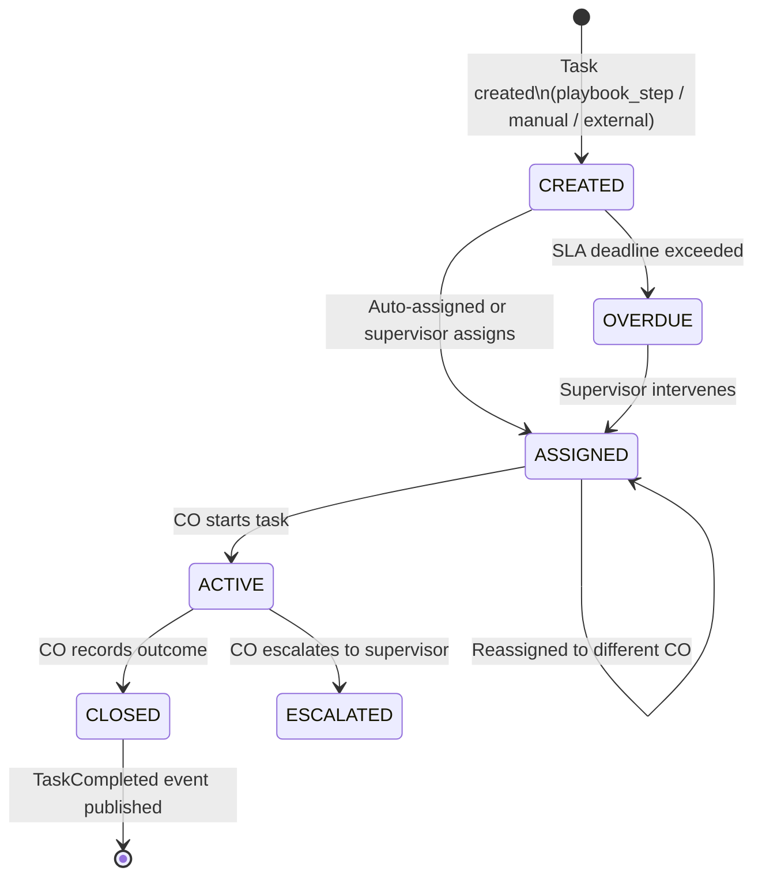

# Capability: Task Engine

**Product**: Sensei — [PRODUCT](../../PRODUCT.md)
**Portfolio**: Operations
**Product Owner**: TBD (Operations PO)
**Status**: 📝 Draft — @FEATURE decomposition pending
**Last Updated**: 2026-03-06

---

## Business Function

Provide a unified task tracking system for branches — aggregating work from Sensei's own playbooks, external service requests (Onigiri, Matcha), and supervisor-created tasks into a single worklist with lifecycle tracking, SLA enforcement, and outcome recording. Sensei is a **task tracker, not a workflow orchestrator** — domain-specific workflows stay in their own systems.

## Why It Exists (First Principles)

- **Accountability**: Every customer interaction must be recorded. Without task records, there is no audit trail of attempts, outcomes, or compliance adherence.
- **Throughput Visibility**: Management cannot measure what is not tracked. Tasks provide the atomic unit of measurement for staff productivity.
- **Unified Inbox**: Branch staff work across multiple products. Without a centralized worklist, they must switch between Onigiri, Matcha, and other systems. Sensei presents all branch work in one place.
- **Automation**: Tasks generated automatically from events and playbooks eliminate reliance on supervisors manually assigning every piece of work.

---

## Feature Inventory

| Feature | Status | Description |
|---------|--------|-------------|
| Task Lifecycle Manager | Draft | CREATED → ASSIGNED → ACTIVE → CLOSED state machine with OVERDUE and ESCALATED side states |
| External Task Creation Contract | Draft | Consume TaskCreationRequest events from Onigiri, Matcha, and other systems |
| Task Completion Feedback | Draft | Publish TaskCompleted event with outcome, source_ref_id, source_callback for upstream system routing |
| Required Field Validation | Draft | On task closure, validate required fields per action type outcome as defined in Template Library → Action Type Registry |
| Supervisor Task Controls | Draft | Reassign, override playbook step, add manual task, bulk operations |
| SLA Enforcement | Draft | Transition task to OVERDUE when SLA deadline exceeded; SLA values read from Template Library → SLA Defaults. Surface in supervisor exception panel. |

---

## Business Rules

### Task Sources

Task Engine receives tasks from 3 sources. All contract-event-driven tasks are created by Playbook Engine — Task Engine has no direct event-rule processing.

| Source | How Created | Example |
|--------|-------------|---------|
| `playbook_step` | Auto by Sensei's Playbook Engine on playbook activation | Delinquency playbook generates "Call customer" task |
| `manual` | Supervisor creates one-off task in UI | "Visit customer for special follow-up" |
| `external` | External service publishes TaskCreationRequest event | Onigiri needs docs collected; Matcha needs physical ID |

> **Contact Compliance gate**: Before creating any task, Task Engine checks with Contact Compliance. If the customer's daily contact limit is already reached, the task is suppressed and not created. See [Contact Compliance](../contact-compliance/CAPABILITY.md).

### Task Creation Paths

The two primary task creation paths are fully independent — they share no data and do not wait on each other:

```
DaVinci / Core Banking contract events
        ↓
  Playbook Engine   ← classifies event, determines objective, applies strategy
        ↓
  Task Engine       (source = playbook_step)

Onigiri / Matcha
        ↓
  Task Engine directly via TaskCreationRequest event   (source = external)
        ↑
  Playbook Engine is not involved
```

Both path types land in the **same worklist** and follow the same task lifecycle. A customer may simultaneously have a `playbook_step` task (call about overdue payment) and an `external` task (collect KYC docs for Onigiri) — generated from entirely separate triggers with no awareness of each other.

### Task Completion Path

When a CO closes a task, Task Engine always publishes a `TaskCompleted` event. The routing depends on the task source:

```
CO records outcome → Task Engine validates required fields → task moves to CLOSED
        ↓
  TaskCompleted event published (always — even if source_callback is null)
        ↓
  ┌─────────────────────────────────────────────────────┐
  │ source = playbook_step                              │
  │   → Playbook Engine receives outcome                │
  │   → Routes to next Objective in chain               │
  │   → Or escalates contract to AM Worklist            │
  └─────────────────────────────────────────────────────┘
  ┌─────────────────────────────────────────────────────┐
  │ source = external                                   │
  │   → TaskCompleted routed to source_callback topic   │
  │   → Onigiri / Matcha receives outcome + source_ref_id│
  │   → Upstream system resumes its own workflow        │
  └─────────────────────────────────────────────────────┘
  ┌─────────────────────────────────────────────────────┐
  │ source = manual                                     │
  │   → TaskCompleted published with no source_callback │
  │   → No upstream routing; record only                │
  └─────────────────────────────────────────────────────┘
```

Task Engine does not know what the upstream system does with the outcome — it only guarantees delivery. Domain-specific continuation logic stays in the originating system.

### Task Lifecycle States

| State | Meaning |
|-------|---------|
| CREATED | Task generated; awaiting assignment |
| ASSIGNED | CO assigned; not yet started |
| ACTIVE | CO is actively working the task |
| CLOSED | CO recorded outcome; task complete |
| OVERDUE | SLA deadline exceeded while not CLOSED |
| ESCALATED | CO escalated to supervisor for manual decision |

### External Task Creation Contract

```
TaskCreationRequest {
  customer_id        // DaVinci customer ID (required)
  action_type        // must match a valid action type in Template Library → Action Type Registry (required)
  title              // Human-readable, e.g., "เก็บเอกสาร KYC" (required)
  description        // Context for the CO (optional)
  priority           // high | normal | low (default: normal)
  sla_deadline       // ISO timestamp (optional)
  source_system      // "onigiri" | "matcha" | etc. (required)
  source_ref_id      // e.g., loan_application_id (required)
  source_callback    // event topic for completion notification (optional)
  metadata           // opaque JSON — stored but not interpreted (optional)
}
```

### Task Completion Feedback Contract

```
TaskCompleted {
  task_id             // Sensei task ID
  customer_id         // DaVinci customer ID
  action_type         // what was done
  outcome             // typed outcome (PTP, Completed, Refused, etc.)
  outcome_data        // structured data (e.g., PTP amount + date)
  completed_by        // CO identifier
  completed_at        // ISO timestamp
  source_system       // original source
  source_ref_id       // original reference
  source_callback     // echoed back for routing
  metadata            // echoed back opaque metadata
}
```

### Supervisor Task Control Rules

| Control | Action |
|---------|--------|
| Reassign | Move task from one CO to another |
| Override Playbook Step | Skip or insert a step for a specific customer's playbook instance |
| Add Manual Task | Create one-off task not tied to any playbook |
| Bulk Operations | Reassign all tasks from one CO to another (e.g., staff absence) |

---

## Task Lifecycle Diagram



---

## NFRs

| NFR | Requirement |
|-----|-------------|
| Domain ignorance | Sensei must not contain domain-specific logic; external tasks treated opaquely via metadata |
| Event-driven creation | Tasks generated by Playbook Engine from contract events in near-real-time; not batch-scheduled |
| TaskCompleted always published | On CLOSED, TaskCompleted event must always be published (even if source_callback is null) |
| Idempotent creation | Duplicate TaskCreationRequest events with same source_system + source_ref_id must not create duplicate tasks |
